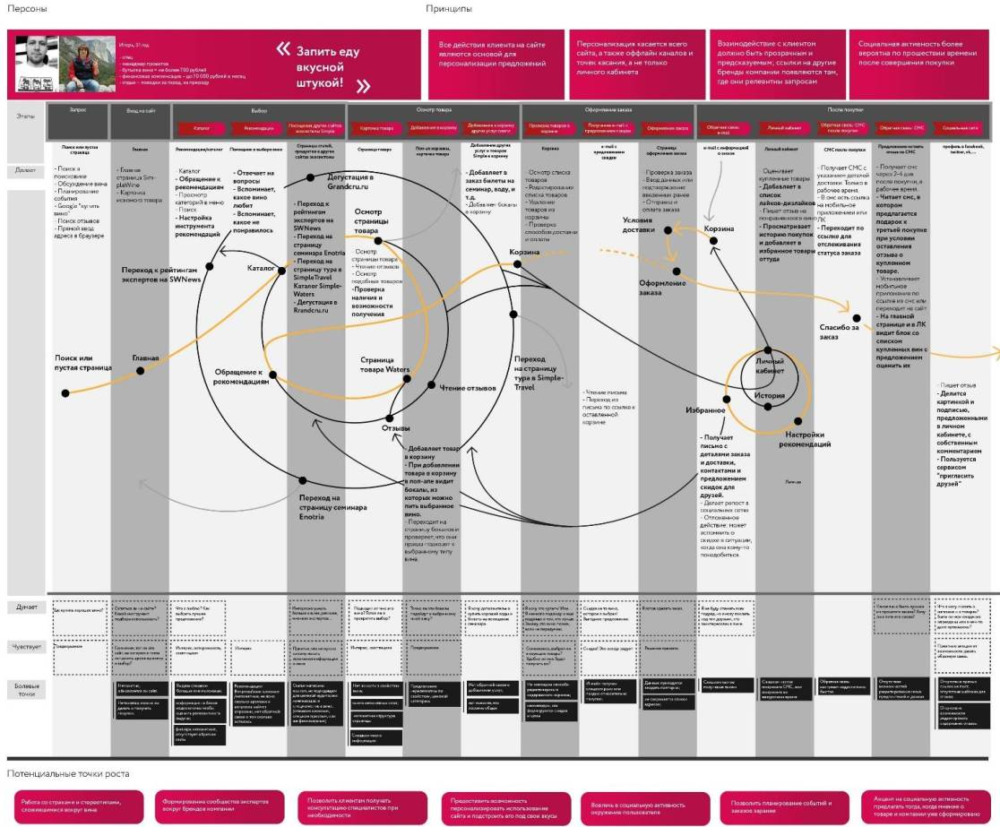

# Customer Journey Mapping
Преподаватель: Таня Колтунова

CJM — путь пользователя к целевому действию между точками контакта с сервисом. Хороший CJM учитывает путь и после целевого действия. Карта содержит необходимую информация для разных типов пользователей.
На карте наглядно видны боли пользователей, она даёт возможность принять правильное решение в сложных задачах.
Карта позволяет связывать метрики (KPI, RR%) с поведением пользователей. И это очень полезно.
_Для одной целевой группы (персоны) рисуется одна CJM диаграмма!_

## Клиенты
Роли и Персоны.
У каждого пользователя при взаимодействии с приложением есть своя роль. У кого-то — почитать новости, у кого-то — задать вопрос, у кого-то — промодерировать комментарий. Цели разные, роли разные и они не пересекаются. Персоны — конктретные персонажи со своими ролями, может быть несколько персон с одной ролью.

## Каналы
Каналы взаимодействия и распространения (привлечения).

* Мобайл
* Десктоп
* Планшеты
* СМС
* Телефонный звонок
* Почта
* ТВ
* Рекомендации друзей

## Точки контакта (тачпоинты)

Страницы сайта, экраны приложения

## Ограничения

* Технические (не можем сделать)
* Законодательные (нельзя делать)
* Маркетинговые (нет денег сделать)

## Общение с пользователями

Без общения с реальными пользователя полезность карты стремиться к нулю.

## Построение CJM

Сначала обозначить персону, для которой мы строим карту и определить её роль и цель.
Далее, составляем шаги, которые эта персона проходит по нашему сервису. Шаги составляются со стороны пользователя, чем он занят в каждый момент времени. Описываются точки контакта и канал, по которому пришел пользователь.

Каждая точка на карте — это страница проекта. 

Начать составление карты можно с простой таблицы. В столбцах перечислены точки контакта, в строках — параметры, по которым мы описываем точки контакта. Внизу в столбцах описываются боли пользователя и его цели, если они есть.

По каким параметрам можно описывать контакт?

* эмоции
* геолокация
* по времени суток
* контекст взаимодействия (дома, на работе, на пикнике)

## Чеклист описания точек контакта

* Канал
* Целевое действие
* Кто отвечает за данную точку?
* Потребность пользователя
* Цель пользователя
* Действия
* Принимаемые решения
* Страхи и боли
* Эмоции
* Критерии успешного прохождения
* Критерии провала
* метрики (KPI), связанные с точкой

## Сервисы для создания CJM

http://touchpointdashboard.com/ Journey Management for the Enterprise
https://uxpressia.com/ Create professional customer journey maps & personas in minutes

## Дополнительные материалы
[Customer Journey Map](https://medium.com/@copylove/customer-journey-map-8a5ac61d6b5e) :ru:
Что такое CJM, когда она полезна и пошаговое руководство по созданию карты.